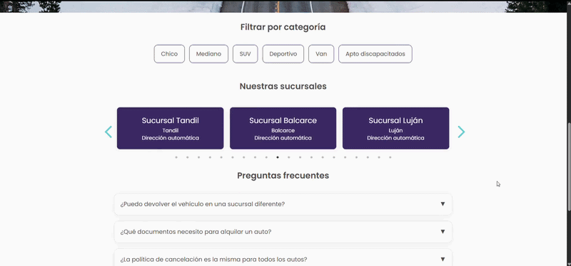
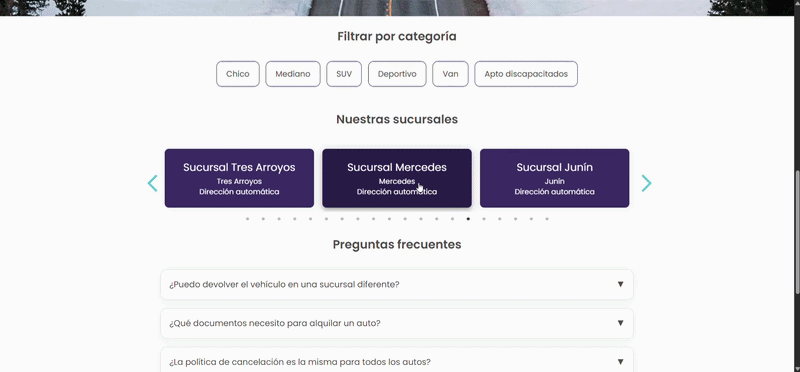

# Alquilapp

Aplicación web para la gestión de alquiler de vehículos, desarrollada como proyecto académico en la Universidad Nacional de La Plata.


## Descripción

Alquilapp permite administrar un sistema de alquiler de autos con distintos tipos de usuarios (clientes, empleados y administradores), incluyendo funcionalidades de autenticación, reservas y gestión de vehículos.
El sistema implementa autenticación de usuarios, control de roles y funcionalidades de recuperación de cuenta, con una arquitectura separada entre frontend y backend.


## Vista Previa

### Inicio


### Selección de sucursales


### Filtro de autos disponibles por sucursal


## Tecnologías utilizadas

**Backend**
- Python
- Flask
- Flask-JWT-Extended
- Flask-Mail
- SQLAlchemy
- MySQL

**Frontend**
- JavaScript
- Vite / React


## Funcionalidades principales

#### Autenticación y usuarios
- Registro e inicio de sesión
- Autenticación mediante JWT
- Recuperación de contraseña por correo
- Verificación de cuenta (2FA para administradores)

#### Gestión de usuarios
- Roles: cliente, empleado y administrador
- Alta de empleados por administradores
- Edición de perfil de usuario
 
#### Gestión de vehículos
- Registro y administración de vehículos
- Asociación con sucursales
- Estados de disponibilidad
  
#### Reservas
- Creación y gestión de reservas
- Asociación con vehículos y usuarios
- Manejo de estados de reserva


## Instalación

### Clonar el repositorio

```bash
git clone https://github.com/sosogarehichi/Proyecto-ING2.git
cd Proyecto-ING2
```

### Backend

```bash
cd backend
python -m venv venv
venv\Scripts\activate   # en Windows
pip install -r requirements.txt
py app.py
```

### Frontend

```bash
cd frontend
npm install
npm run dev
```

### Base de datos

1. Crear base de datos MySQL
2. Ejecutar script:
```
baseDatos.sql
```

## Notas

- El proyecto utiliza arquitectura cliente-servidor separada.
- La autenticación se maneja mediante JWT.
- El envío de emails requiere configuración de SMTP.
- Algunos módulos están diseñados con enfoque académico.

## Autores

Proyecto grupal desarrollado por estudiantes de la UNLP.
Martina García, Emanuel Alvarez Landolfi, Anita Ormello Barral, Sofia Garehichi.

### Contribución personal

Tuve un rol activo en el desarrollo del frontend y en el diseño de la experiencia de usuario (UI/UX), participando en la implementación de múltiples funcionalidades clave orientadas al usuario final.

#### Funcionalidades desarrolladas

- Visualización y edición de perfil de usuario.
- Recuperación de contraseña.
- Visualización de política de reservas.
- Notificación de pago satisfactorio.
- Página de inicio (Home).
- Sección de contacto.
- Preguntas frecuentes (FAQ).
- Búsqueda de sucursales.

#### Diseño e interfaz
- Diseño de la mayor parte de la interfaz web.
- Definición de la experiencia de usuario (UX).
- Implementación de componentes visuales en el frontend.


## Estado del proyecto

Proyecto académico funcional en desarrollo y expansión.
